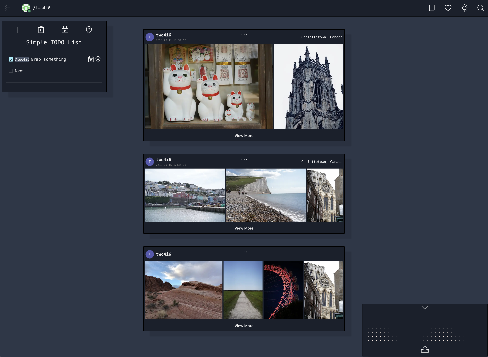

# A photography workflow app

[Demo](https://demo.luobo.ca)

still learn js & react

still under development

# Task
- [ ] Email user authentication (currently oauth 2.0 only)
- [ ] Redesign API to a rest API
- [ ] Make todo list persistence 
- [ ] Get the geographic data from photo (currently dummy data)
- [ ] Make the home page show posts by all users

# Project structure
```
$PROJECT_ROOT
│   # Page files & React component files
├── src
│    │ # Page files
│    ├── pages
│    │ # React component files
│    └── components
│   # Non-react modules
├── lib
│   # Static files
└── public
```

# Preview

